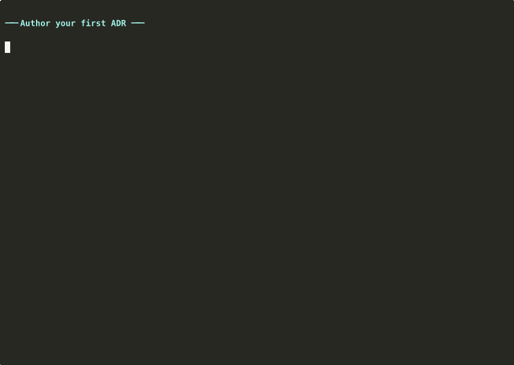

# ADR Lint

Automatically validates code changes against Architecture Decision Records (ADRs) using Claude as the analysis backend.



(Fresh repo to a caught violation in one take: `adr-lint create` scaffolds the
ADR, frontmatter narrows what it applies to, then staging a `fmt.Println` that
violates the decision lights up `❌` with a concrete fix. Reproduce with
[`./scripts/demo/record_demo.sh`](scripts/demo/record_demo.sh) — needs
`asciinema`, `agg`, and the `claude` CLI on PATH.)

## What it solves

ADRs are how teams record architectural decisions, but they drift out of
sync with the code as soon as the ink dries — nothing checks new diffs
against the rules. `adr-lint` closes that loop: every commit (or PR) is
read against the ADRs in `doc/adr/`, and violations come back with the
file, line, and a suggested fix.

## How it works

For each lint run:

1. **Collect a diff** — staged files by default, the full branch diff vs
   `main` with `--branch`, or specific paths with `--files`.
2. **Match `applies_to`** — each ADR's glob list decides whether it cares
   about any of the changed paths. Non-matching ADRs are skipped.
3. **Apply `pre_filter`** — a substring shortcut. If none of the ADR's
   pre-filter strings appear anywhere in the diff, the LLM call is skipped
   entirely and the ADR passes. This is the difference between a free
   re-run and a paid one.
4. **Ask Claude** — surviving ADRs are sent to the Claude Code CLI with
   the diff. The model returns pass/fail + location + a fix.

The Claude CLI is the analysis backend — there's no API key plumbing, the
tool shells out to `claude` and inherits whatever auth your account
already has.

## Quickstart

```bash
# 1. Install + log in to the Claude Code CLI (one-time, no API key needed)
#    https://claude.com/claude-code

# 2. Install adr-lint (pick one)
brew install wbern/tap/adr-lint
# or:
go install github.com/wbern/adr-lint/go/cmd/adr-lint@latest

# 3. Write your first ADR
adr-lint create "Use the logger package instead of fmt.Println"
# Edit doc/adr/0001-*.md: tighten applies_to globs, add pre_filter
# substrings, write the decision body. See "ADR file format" below
# for what each frontmatter field does.
adr-lint accept 1

# 4. Try it against a staged change before wiring it as a hook
#    (stage a file whose path matches your ADR's applies_to glob,
#    otherwise the ADR won't load and you'll see nothing)
git add some-file.go
adr-lint                              # one-shot check, prints violations

# 5. Wire it into git so it runs on every commit
cat > .git/hooks/pre-commit <<'EOF'
#!/usr/bin/env bash
set -e
command -v adr-lint >/dev/null || exit 0    # no-op for collaborators without it
adr-lint
EOF
chmod +x .git/hooks/pre-commit
```

## Picking your first ADRs

The single test that decides whether a decision belongs in an
adr-lint-enforced ADR (vs. a design doc, RFC, or runtime check) is:

> Could a reviewer who only sees this PR's diff, with no broader
> context, catch a violation of this rule?

If yes, it's a fit. If no, the rule belongs somewhere else — writing
it as an ADR will produce noisy false negatives or false positives.

### Three ways to surface candidates

1. **Cluster your `fix:` commits.** Each fix is a lesson the project
   already paid for; recurring patterns are exactly the rules worth
   crystallizing.

   ```bash
   git log --grep='^fix' --oneline | head -50
   ```

   Three separate fixes for panics on unchecked map lookups? That's
   an ADR ("require ok-form for map access in `pkg/cache`").

2. **The rules you keep typing in code review.** Any nit you've left
   on three different PRs is a candidate. If someone needed to be
   told, the project needs to write it down.

3. **Hotspot analysis.** Files that are both high-complexity *and*
   high-churn (per Adam Tornhill's *Your Code as a Crime Scene*) are
   where architectural decisions matter most — that's where you've
   been paying the cost of *not* having a rule. Surface them with
   [obscene](https://github.com/wbern/obscene):

   ```bash
   pnpm dlx @wbern/obscene --format table     # no install needed
   # or: pnpm add -g @wbern/obscene
   ```

   `obscene` combines `scc` cyclomatic complexity with git churn to
   rank files that are both complex and actively modified. The top
   of that list is where new ADRs land highest-leverage. (Needs `scc`
   on PATH: `brew install scc`.)

### Shapes that play well with adr-lint

ADRs the linter can mechanically enforce share a shape: a specific,
diff-visible rule in active voice. Good patterns:

- **Forbidden imports / packages.** "Don't import `openai` — use the
  Claude Code CLI."
- **Required wrapper functions.** "Use `logger.Info`, not `fmt.Println`."
- **File-location rules.** "HTTP handlers live in `internal/api`."
- **API-shape rules.** "Controllers must not return database models —
  wrap in DTOs first."
- **Required error-handling idioms.** "Errors from `db.*` calls must
  be wrapped with `errors.Wrap`."

All of these answer the diff-visibility test: a reviewer staring at
the unified diff alone could spot a violation. For a real worked
example in this repo, see
[ADR-0001](doc/adr/0001-claude-is-the-only-llm-provider.md) — the
forbidden-imports pattern applied to LLM providers.

### Shapes that don't

Skip ADRs for rules that require whole-program or runtime context:

- **"Services should be loosely coupled"** — needs system-wide view.
- **"Prefer eventual consistency where possible"** — depends on
  end-to-end data flow.
- **"Minimize blast radius"** — operational, not diff-visible.

These deserve to be documented (in an RFC or design doc), but
adr-lint can't enforce them.

### Keep runs cheap

Every ADR whose `applies_to` glob matches the staged diff potentially
triggers a Claude Code call. Two levers keep that cost down:

1. **Tight `applies_to` globs.** Don't write `["**/*"]` if the rule
   only governs `go/**/*.go`. ADRs whose globs miss the diff are
   skipped at zero cost.
2. **Meaningful `pre_filter` substrings.** Two or three keywords from
   the rule's vocabulary. If none appear in the diff, the LLM call is
   skipped and the ADR auto-passes with a clear explanation.

This repo's own three ADRs are tight by design and good references:

| ADR | `applies_to` | `pre_filter` |
|---|---|---|
| [0001](doc/adr/0001-claude-is-the-only-llm-provider.md) | `go/**/*.go` | `gemini`, `vertex`, `openai` |
| [0002](doc/adr/0002-trunk-based-releases-via-release-please-auto-merge.md) | workflow + goreleaser files | `release-please`, `goreleaser` |
| [0003](doc/adr/0003-dogfood-adr-lint-locally-not-in-ci.md) | workflows + `lefthook.yml` | `adr-lint`, `adr_lint` |

A commit that doesn't touch any of those surfaces costs nothing.

### Going deeper on ADR craft

adr-lint is opinionated toward *enforceable* rules. Classic ADR
practice is broader — decision archaeology, alternatives auditing,
team communication. For that side of the discipline:

- [Michael Nygard's original 2011 post](https://cognitect.com/blog/2011/11/15/documenting-architecture-decisions)
  — the foundational write-up; start here if ADRs are new to you.
- [MADR](https://adr.github.io/madr/) — the most widely-used ADR
  template; emphasizes considered alternatives.
- [joelparkerhenderson/architecture-decision-record](https://github.com/joelparkerhenderson/architecture-decision-record)
  — curated examples and a dozen template variants.

## ADR file format

ADRs live in `doc/adr/NNNN-slug.md` with YAML frontmatter that controls
how the linter treats them. The full annotated template is at
[`doc/adr/templates/template.md`](doc/adr/templates/template.md) — copy
it into your project to customize the scaffold.

| Field           | Purpose                                                                                  |
| --------------- | ---------------------------------------------------------------------------------------- |
| `status`        | `proposed` / `accepted` / `rejected` / `withdrawn` / `deprecated` / `superseded`         |
| `applies_to`    | Doublestar globs; `!`-prefix negates. Defaults to `["**/*"]`.                            |
| `pre_filter`    | Substrings that must appear in the diff for the LLM to be invoked. Free pass otherwise.  |
| `complexity`    | `lite` / `standard` / `complex` — controls chunking and how much context Claude sees.    |
| `enforced_by`   | Marks the ADR as covered by external tooling (eslint rule, type check). LLM skips it.    |
| `diff_context`  | `false` evaluates each file in isolation. Defaults to `true`.                            |
| `superseded_by` | Set automatically by `adr-lint supersede`; points at the replacement.                    |

Only `status` is required. Everything else has sensible defaults — the
goal is that an ADR with no frontmatter still works, and you add fields
only when you want to tighten scope or speed things up.

## Commands

### Managing ADRs

```bash
adr-lint create "Use Testify for tests"  # scaffold doc/adr/NNNN-*.md from template
adr-lint list                            # id, status, title (one per line)
adr-lint show 1                          # raw file contents
adr-lint accept 1                        # flip status: accepted
adr-lint reject 1                        # status: rejected
adr-lint withdraw 1                      # status: withdrawn
adr-lint deprecate 1                     # status: deprecated
adr-lint supersede 1 2                   # 0001 → superseded; writes superseded_by: "0002"
adr-lint validate                        # cross-refs, IDs, status invariants
adr-lint version                         # print binary version
adr-lint help                            # subcommand reference
```

`supersede` writes both halves of the link so `list` can surface the
relationship without you opening the file.

### Running the lint

```bash
adr-lint                       # check staged files (default; matches the pre-commit hook)
adr-lint --branch              # check the full diff vs main (PR-review mode)
adr-lint --files pkg/foo.go    # check specific paths
adr-lint --dry-run             # show which ADRs would run; skip LLM calls
adr-lint --verbose             # print provider, mode, and applicable ADRs
adr-lint --no-cache            # bypass the result cache
adr-lint --per-file            # one chunk per file (slower, more precise)
```

## Integration

### Pre-commit hook (adopting adr-lint in your project)

Drop this into `.git/hooks/pre-commit` in your repo — it runs
`adr-lint` on staged files and exits cleanly if the binary isn't on
PATH, so collaborators without it aren't blocked:

```bash
cat > .git/hooks/pre-commit <<'EOF'
#!/usr/bin/env bash
set -e
command -v adr-lint >/dev/null || exit 0
adr-lint
EOF
chmod +x .git/hooks/pre-commit
```

The same script lives at [`scripts/pre-commit`](scripts/pre-commit) in
this repo for reference.

This is the zero-dependency option for using adr-lint in **your** repo.
For working on adr-lint itself, see [CONTRIBUTING.md](CONTRIBUTING.md) —
this repo uses lefthook to orchestrate adr-lint alongside gofmt,
golangci-lint, and gitleaks.

### CI (PR review)

`adr-lint --branch` is designed for CI: it lints the entire diff that
would land in the PR, no staging required. The runner needs the Claude
Code CLI installed and authenticated, which in practice means a
self-hosted runner. The `.github/workflows/ci.yml` in this repo only
runs the Go test suite and linters — it's not a reference for running
`adr-lint` itself in CI (see [ADR-0003](doc/adr/0003-dogfood-adr-lint-locally-not-in-ci.md)
for why this repo doesn't dogfood adr-lint in CI).

## Focused demos

The hero GIF above is the full tour. The per-section ones under
[`docs/`](docs/) are shorter and useful for pointing a colleague at a
single slice:

- [`demo-create.gif`](docs/demo-create.gif) — author your first ADR
- [`demo-lint.gif`](docs/demo-lint.gif) — violation caught, fix, re-run hits the pre-filter shortcut
- [`demo-branch.gif`](docs/demo-branch.gif) — PR review with `--branch`
- [`demo-lifecycle.gif`](docs/demo-lifecycle.gif) — supersede a decision

For a guided discovery flow that also drafts the ADR body, the
`/create-adr` Claude Code slash command remains available alongside the
CLI scaffold.

## Contributing

Working on adr-lint itself? See [CONTRIBUTING.md](CONTRIBUTING.md) for
local setup (lefthook, golangci-lint, gitleaks), commit message rules,
and how this repo dogfoods its own linter.
